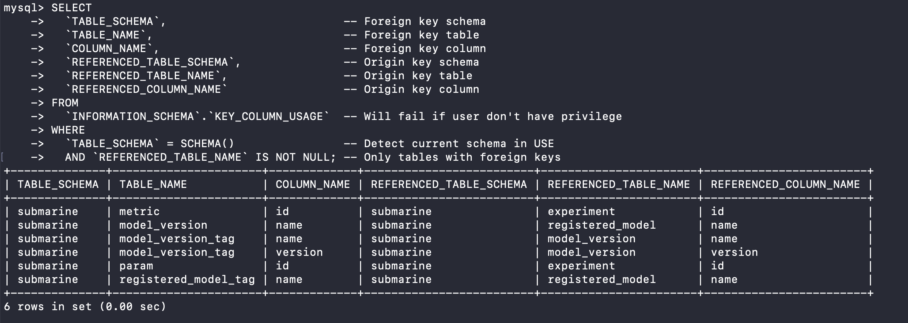

# Apache Submarine Tools

This repo provides tools in order to speed up developing and testing.

## Starting services

```bash
docker compose build
docker compose up -d
```

### Database Schema



## Running tests

Expose Submarine service.

```bash
kubectl port-forward --address 0.0.0.0 -n default svc/submarine-server 8080:8080
```

Set up Python venv.

```bash
cd submarine-sdk/pysubmarine
python3 -m venv .venv
source .venv/bin/activate
pip install -U pip setuptools wheel
pip install -r github-actions/test-requirements.txt
pip install -e '.[tf2,pytorch]'
```

Set CLI config for e2e test.

```bash
submarine config set connection.hostname localhost
submarine config set connection.port 8080
```

Run tests.

```bash
pytest tests -m 'e2e'
```

## References

<https://github.com/apache/submarine/tree/master/dev-support/database>

<https://github.com/apache/submarine/blob/master/.github/workflows/python.yml>
